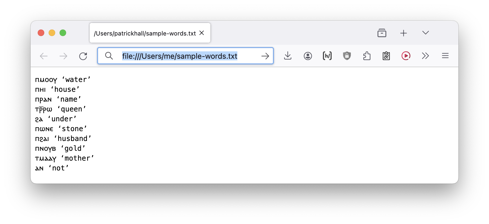

<main>

## The web and Egyptology

> Note: If you’re hanging around this site, chances are you have some interest in the languages of Egypt. I should preface this whole discussion by admitting up front that I am _woefully_ under-informed with respect to Arabic, which is of course today the major language of the modern state of Egypt. The term “Egyptology” has some rather icky associations, and one of them (at least in my opinion) is that it’s usually taken to refer to the cultures of Ancient Egypt and late antiquity (if I’m using that term right…). People who are studying Egyptian Arabic, at least as far as I know, don’t often use the term “Egyptology”. The examples in these tutorials will be drawn primarily from various stages of Egyptian and Coptic — I plan to do enough research to include a bit of Arabic content (from the technical standpoint, it’s also a good language to discuss with respect to writing directions!). 


For some reason I am obsessed with the idea that more people should be empowered to use web technology to do stuff. and as a guy who spent most of his life in (documentary) linguistics, the stuff I always found myself working was stuff related, mostly, to documentation and revitalization. So stuff like building dictionaries, learning tools, interactive text interfaces, stuff like that.

I’ve also been a web guy forever, so naturally all the stuff I built was on the web. But here’s the thing: it’s not obvious what “on the web” means. There are many things that you might say are “on the web”, but the way that they are actually on the web and the ways that they get there can vary wildly.

I would like to share some particular approaches to using the web that I think are simple but still powerful. 

Put briefly: a little understanding of how the web works can go a long, long way, but the amount of information about how to create stuff on the web is so overwhelming that it can be hard to wade through. Standards evolve, capabilities change, “best” practices are moving targets. But there is also a solid core of stuff that has been true for a long time and will continue to be true for a long time: consider that [the first web page](http://info.cern.ch/hypertext/WWW/TheProject.html) was created in 1991 and it’s still accessible today. That’s _bonkers_. Could you even open a Microsoft Word document from 1991? I mean, maybe.

> If anyone has ideas for specific small projects they'd like to work on, ideas are welcome. I’m planning to start with basics of what a web page is and how to create and view one. I’ll use examples from Coptic and Egyptian, again, alternate content would be welcome as well.
> 
> Also, if anyone would actually like to put something on the web, we can do that — either by hosting them on github, on your own site if you have one, or you are welcome to take a corner of <glyphical.net>, my own site (assuming the content is more on less on topic, of course!)

## 🕸️ Let’s learn about what a web page is

🕸️ The modern web has become kind of opaque. The workflows people use to access information often involve apps, which are different from the web — they apps of the kind that you download from an app store are designed run on phones, and they are great for that purpose — they are simple, easy to use, and have advanced interactions like smooth animation.

🕸️ Will the web be replaced by these apps? Nope. The web has some killer features that make it more maintainable, cheaper, and more accessible to users, including users on mobile devices. 


Okay, here’s the short list we will use to create our first page:

```
ⲡⲙⲟⲟⲩ ‘water’
ⲡⲏⲓ ‘house’
ⲡⲣⲁⲛ ‘name’
ⲧⲣ̅ⲣⲱ ‘queen’
ϩⲁ ‘under’
ⲡⲱⲛⲉ ‘stone’
ⲡϩⲁⲓ ‘husband’
ⲡⲛⲟⲩⲃ ‘gold’
ⲧⲙⲁⲁⲩ ‘mother’
ⲁⲛ ‘not’
```

What we will do first is create a plain text file with this content. If you’re not familiar with creating a <a href=https://en.wikipedia.org/wiki/Plain_text target=_blank>plain .txt file</a>, then here’s instructions (partially ChatGPT’d, I admit): <a href="how-to-create-a-txt.html">Creating a text file on Windows/Mac/Linux</a>


🕸️  Here’s what I get when I open the file in my browser. Take a look at the URL in the address bar, it’s a bit weird:  `file:///Users/me/sample-words.txt` First off, most URLs do not start with file, they start with http or https. This is because opening a file in the way we have here (`Right click > Open with…`) opens the file from the file system in the same way you might with a word processing program like Word, or any other desktop application. This matters a lot, as it turns out, but we will come back to this issue. For now, opening files this way is enough to mess let us mess around with a web page. Which we will now do.




🕸️ Here’s an important fact:

HTML files are just text files that have .html instead of .txt as their file suffix
🕸️ Proof: go to the directory where your sample-words.txt file is saved, and dupilicate it. (On Mac that will result in a file called sample-words copy.txt. Rename that file to sample-words.html. Now open that in the browser just like you did before.
🕸️ Note that there might be some weirdness when you change the file suffix.  A Mac, for instance, throws the message above. The default application for a .txt file is a text editor, whereas the default application for an .html file is whatever your default browser is. It’s find to say Use .html here. Then double-click the resulting file, or else use Right click -> Open with… and choose a browser. (Same difference.)


</main>