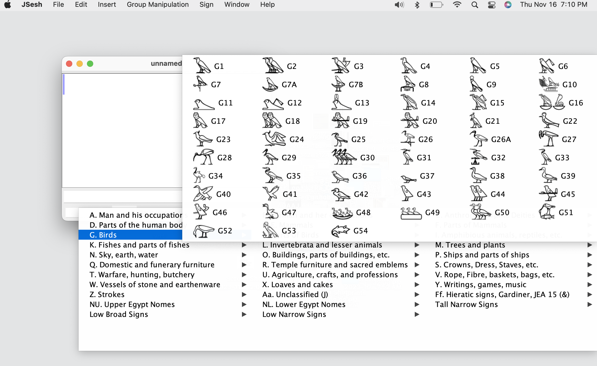

I have become rather obsessed with learning about Ancient Egyptian. As my background is in web-based language documentation, I am interested in the way that Egyptian text is digitized. I’m also interested in issues of usability in working with digital linguistic data. Digital Egyptology, if that’s a thing, offers a lot of interesting challenges in this regard.

## How do I type hieroglyphs?

I have to confess that I find the available options for inputting hieroglyphs too specialized. It seems that the quasi-standard input method out there is either input the [Manuel de Codage](https://en.wikipedia.org/wiki/Manuel_de_Codage) or “MdC” system to specify hieroglyphs, and then use a conversion system of some kind. The main tool that people seem to use for this is  Serge Rosmorduc ’s [JSesh](https://jsesh.qenherkhopeshef.org/), which is a very nice piece of software which has been well maintained over the years, and is very active. ([WikiHiero](http://aoineko.free.fr/) is another tool, but it doesn’t go to Unicode hieroglyphs.)

There are many other tools that cover various aspects of handling hieroglyphic text, but for me they all fail in one regard: I don’t know many hieroglyphs, so finding in a list takes a long time. Even when the software provides a list, carrying out a visual search among… well, suppose you are looking for the “headstand guy”:

<div style=font-size:3rem>𓀡</div>


How long does it take you to find him in the list? 

In JSesh, you’d navigate to the “Man and his occupations” category, and eventually you’d find him:


There he sits, er, hand-stands, at `A29`. Not too bad. 

But what if you don’t know the name of the sign? What if you don’t know the Gardiner category? You almost certainly haven’t memorized the Gardiner number — there are over 1000 of them! So there’s nothing for it but to search. And search. And search.

## What’s wrong with the Gardiner classification system?

There’s nothing wrong with the Gardiner _classification_ system. It does that fine. The problem is that the same sign can reasonably be classified in more than one way. Wikipedia offers [a good summary of the problem](https://en.wikipedia.org/wiki/Gardiner%27s_sign_list), with regard to this sign:

<div style=font-size:3rem>𓅒</div>

> Gardiner does not cross-index signs; once put on the list, other significant uses may be overlooked. One example of this is  𓅒 `G16`, _nbtỉ_, the ideogram for the Two Ladies, goddesses Wadjet as the cobra and Nekhbet as the white vulture. These are the protective and patron goddesses of the separate Egyptian kingdoms that joined into ancient Egypt, who were both then displayed on the uraeus of Wadjet when the unification occurred and afterward considered jointly to be the protectors of Egypt and the pharaohs. This ideogram is listed only in the bird list (G), and overlooked on the deity list (C) and the reptile list (I). 

I don’t know about you, but my reaction is “what the heck is this thing doing in the `Bird` category”?



And then, there are signs that are just _weird_, like this one:

<div style=font-size:3rem>ğ“</div>

What the heck is that? A spark plug? What category is it in? As it happens, it’s a variant of 

<div style=font-size:3rem>ğ“</div>

…which is a “drill for beads”… which is in the “Agriculture, crafts, and professions” category. Alrighty then. It’s not that it’s a bad classification or something, it’s just that it’s not predictable from looking at the hieroglyph itself.


## Just use Manuel de Codage codes…

So, I hear you say, “That’s why we have [Manuel de Codage](http://www.catchpenny.org/codage/).” I’m no expert, but I don’t see that as a solution either, because it assumes that you know the values for all the hieroglyphs.  Clearly, while that may be a viable approach for more experienced students, but it’s not a good solution for learners — they simply aren’t familiar enough with hieroglyphs, let alone remembering MdC codes. There’s also the irritating byproduct of using Manuel de Codage that it tends to become a _replacement_ for Unicode hieroglyphs, even though they came about decades ago, when Unicode hieroglyphs were not available. I for one want to see the actual characters I’m studying, not a transliteration of them. One still encounters sometimes vociferous voices online suggesting that new students should _only_ work in MdC. Personally, I think that’s a mistake. And I’m [not](https://thotsignlist.org/About) the [only one](https://mjn.host.cs.st-andrews.ac.uk/publications/2012b.pdf) who thinks so.

Incidentally, I’m on talking about _finding hieroglyphs_ here, not specifying what their _readings_ are (that is, whether a given hieroglyph is being used as a phonetic, determinative, or ideogram in a given context). The whole topic of annotating the readings of hieroglyphs is a whole ’nother can of worms, but for me at least, until there’s a story for writing down he hieroglyphs reasonably effectively, that problem is out of scope. And anyway, [other people are already working on those](https://thotsignlist.org/About).

## It’s not just categorization we need — we also need tagging.

What if you were trying to talk to another student of Ancient Egyptian about a particular hieroglyph? How would you describe a given sign? I can think of lots of ways, and I’m sure you can as well:

* 𓀡
    * “The upside-down guy.”
    * “The headstand one.”
    * “The one walking on his hands.”
* 𓅒
    * “The uraeus hieroglyph.”
    * “That one with the snake in it.”

Etc, etc. What it really comes down to is something more akin to _tagging_ or _labeling_ than classification. In fact, we can think of other, weirder ways to “tag” hieroglyphs:

* 𓅒
   * “two-by-two grid” - the layout
   * “two baskets” - counting sub-signs
   * “Wadjet” - relevant name
   * “Nekhbet” - relevant name
   * “Two Ladies” - relevant label

And so forth. Such labels are particularly relevant for hieroglyphs that are hard to draw — like the “headstand guy” above, or my beloved derpy duck:

<div style=font-size:3rem>𓅷</div>

Oh wait, that’s a _duckling_, not a duck. Looks like a duck to me.

<div style=font-size:3rem>𓂓</div>

“Two arms upraised”?? Come on. That’s clearly a “field goal”. 

<details>
<summary>Clearly.</summary>

</details>


Anyway. The point is that there are many ways one might refer to a hieroglyph. 

## But why?

One word: input. I want to be able to find a hieroglyph so I can input it. And I want to be able to use any one of many labels to narrow down the possibilities instead of searching visually. It’s true that this means several keystrokes per hieroglyph, potentially, but I still think it will be faster than mentally categorizing (sometimes repeatedly) and then searching visually.

So let’s take this little input box. Let’s say we want to find the “headstand guy”. Now, obviously, if there is a headstand guy button, the problem is trivial:

<form id="search-1">
    <input value="" autocomplete="off" placeholder="Prepare to be amazed…" type="text" id="search-1-input">
    <label id="search-1-label">Click headstand guy:
    <button id="amaze">𓀡</button></label>
</form>

<script>
    const searchInput = document.querySelector('#search-1-input');
    const label = document.querySelector('#search-1-label');

    document.querySelector('#amaze').addEventListener('click', function() {
        searchInput.value = '𓀡';
        label.textContent = 'Okay not that amazing.';
    });

    // Prevent form submission
    document.querySelector('#search-1').addEventListener('submit', function(e) {
        e.preventDefault()
    })
</script>
<style>
  #search-1 {
    display: grid;
    gap: 1em;
    padding: 1em;
    background: #efefef;
}

#amaze {
    background: white;
    justify-self: start;
}
</style>

What we need is a way to search for the headstand guy. 


```{=html}
<data-viewer>
{
"hieroglyph": "𓀡",
"description": "man upside down",
"gardiner": "A29",
"category": "Man and his occupations",
"codepoint": "U+13021"
}
</data-viewer>
```